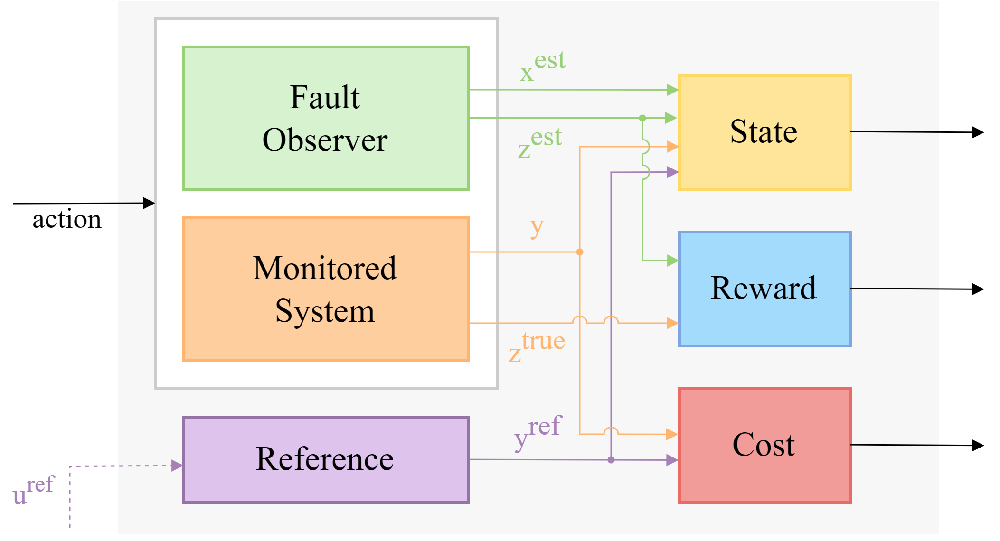

# FIERL
This is the code to obtain the results in "Fault Identification Enhancement with Reinforcement Learning (FIERL)", an approach to perform Active Fault Diagnosis.

It contains the implementation of a model-based fault observer with Kalman Filter-like derivation and it implements Constrained Policy Optimization (CPO), a Constrained Reinforcement Learning approach, to find an integrated control input to maximize the observer performance while ensuring a user-defined performance in the tracking control. 



The environment accepts any system of the class `FaultyActuatorNoisySystem`. In our experiments, we used the Three-Tank benchmark system. 

## Installation
This code requires Python 3.6. 

To install this package: 
```
git clone https://github.com/davidesartor/FIERL.git
cd FIERL
pip install -e .
```

## Usage 
**Train an agent**: to train the agent using the implemented Three-Tank system: 

```
python scripts/train_3tank.py
```
**Plot the results of the training**:
```
python scripts/plot.py fpath
```
Params:
- `fpath` (str): the path to the model to load
  
**Watch trained policy**: to run trained policy uses: 
```
python scripts/test_policy.py fpath [params]
```
Required params: 
- `fpath` (str): the path to the model to load

Optional params: 
- `len` (int): length of the simulation/episode to run. Default is 120. 
- `episodes` (int): number of simulations to run. Default is 1. 
- `norender`: disable the render of the environment
- `faults_list` (list): list of faults. Example of correct form --faults_list [[1, 2, 3], [4, 5, 6], [7, 8, 9]]. If None, then random faults are generated. Default is None.
- `fault_change_step` (int): number of fixed steps between fault changes. If None, the steps of the changes are randomly sampled. Default is None. 
- `faults_number` (int): number of faults to change within an episode. Default is None. 
- `min_steps` (int): minimum number of steps between fault changes. Needed only if `fault_change_step` is None and `faults_list` is None. Default is None.
- `max_steps` (int): maximum number of steps between fault changes. Needed only if `fault_change_step` is None and `faults_list` is None. Default is None. 
- `save`: save the plots
- `save_file_name` (str): name of the images. Default is None.
- `save_format` (str): format of the images. Default is None. 
- `adaptive_len`: to extend the length of the episode to ensure the number of randomly generated faults.

To run the comparison between the trained policy and the noisy proportional controller uses: 
```
python scripts/test_comparison.py fpath [params]
```

Additional parameters with respect to _test_policy.py_ : 

- `kp` (list[float]): proportional gains. Default is [0.016, 0.016]
- `ki` (list[float]): integral gains. Default is None. 
- `kd` (list[float]): derivative gains. Default is None. 
- `Ts` (float): sampling time. Default is 0.1. 
- `overlapped_plots`: to compare the data coming from the two control actions in the same plot, component by component, instead of different ones.


Example: 
```
python scripts/test_comparison.py data/3Tank --min_steps 30 --max_steps 60 --adaptive_len --overlapped_plots
```

## References
- [Constrained Policy Optimization](https://proceedings.mlr.press/v70/achiam17a.html)
- [Benchmarking Safe Exploration in Deep Reinforcement Learning ](https://openai.com/research/benchmarking-safe-exploration-in-deep-reinforcement-learning)

This code uses [Safety Starter Agents](https://github.com/openai/safety-starter-agents) for CPO implementation.


